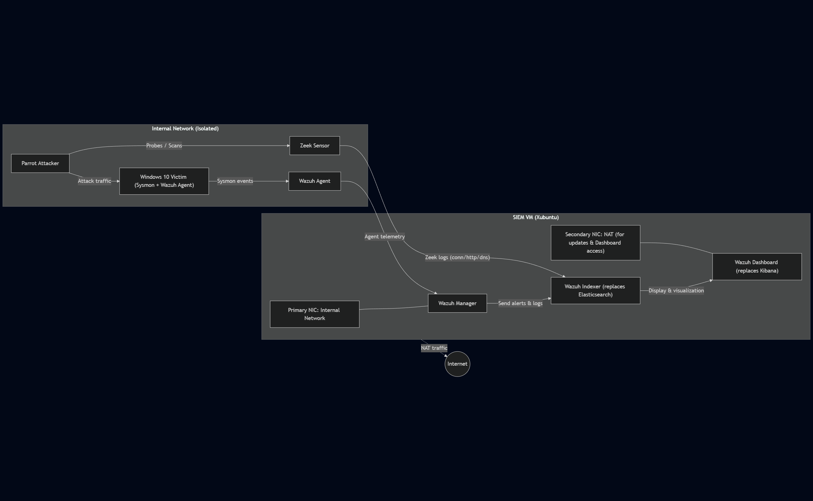
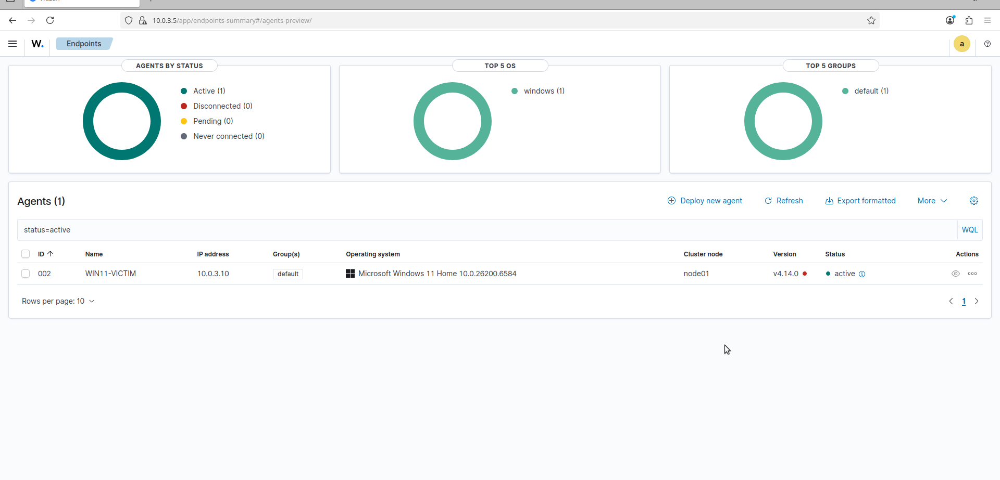
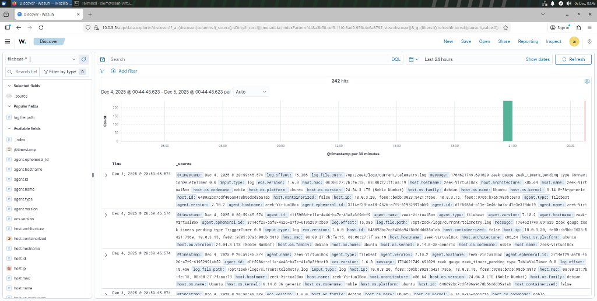

# Security Telemetry Engine

## Evaluating Cross-Layer Host–Network Telemetry Correlation in a Reproducible SOC Testbed

**Author:** Syed Ahsan Ahmed  
Department of Computer Science Engineering  
Lords Institute of Engineering and Technology


---

##  Research Paper

This repository accompanies the research paper:

> **Evaluating Cross-Layer Host–Network Telemetry Correlation in a Reproducible SOC Testbed**

The project presents a controlled empirical evaluation of SIEM-level host–network telemetry correlation using a reproducible Security Operations Center (SOC) testbed built with **Wazuh**, **Sysmon**, and **Zeek**.

Unlike traditional IDS research, this work does **not** introduce a new detection algorithm. Instead, it isolates **cross-layer telemetry correlation** as the independent architectural variable and evaluates its operational impact on:

- Detection performance
- Detection latency
- Alert consolidation
- Correlation window sensitivity
- Framework robustness under telemetry degradation

---

#  Architecture

<p align="center">

</p>

The experimental environment consists of:

| Component | Purpose |
|-----------|---------|
| 🐧 Parrot Security | Attack generation |
| 🪟 Windows 11 + Sysmon | Host telemetry |
| 🔍 Zeek Sensor | Network telemetry |
| 🛡 Wazuh Stack | SIEM, indexing and visualization |

---

#  Key Experimental Results

| Metric | Result |
|---------|--------|
| Raw Telemetry | **53 Events** |
| Correlated Incidents | **4** |
| Alert Consolidation Ratio | **92.45%** |
| True Positive Rate | **100%** |
| Detection Configurations | Host • Network • Cross-layer |
| Correlation Windows | 10 s • 30 s • 60 s |

---

#  Repository Structure

| Path | Description |
|------|-------------|
| attacks/ | Attack scripts and execution workflow |
| detections/ | Detection rules and correlation artifacts |
| docs/ | Research summary and documentation |
| images/ | Architecture diagrams, screenshots and figures |
| scripts/ | Automation and experiment scripts |
| README.md | Project overview |

---

#  Research Objectives

This work experimentally evaluates:

- Host-only detection
- Network-only detection
- Cross-layer correlated detection
- Detection latency
- Alert Consolidation Ratio (CR)
- True Positive Rate (TPR)
- False Positive Rate (FPR)
- Correlation window sensitivity (Δt)
- Robustness under partial telemetry loss

---

#  Testbed Status

| Component | Status |
|-----------|--------|
| Parrot Attacker | ✅ |
| Windows 11 + Sysmon | ✅ |
| Wazuh Docker Stack | ✅ |
| Zeek Sensor | ✅ |
| Host Telemetry | ✅ |
| Network Telemetry | ✅ |
| Correlation Framework | ✅ |
| Experimental Evaluation | ✅ |
| Research Paper | ✅ |

---

#  Screenshots

## Wazuh Dashboard

<p align="center">

</p>

---

## Zeek Telemetry

<p align="center">

</p>

---

#  Documentation

-  Research Paper
-  One-page Research Summary
-  Ethics Statement
-  Architecture Diagram
-  Medium Blog
-  Substack Blog

---

# 📈 Experimental Workflow

1. Deploy reproducible SOC environment
2. Generate controlled attack scenarios
3. Collect host telemetry
4. Collect network telemetry
5. Perform cross-layer correlation
6. Evaluate operational metrics
7. Analyze architectural trade-offs

---

#  Intended Audience

This repository is designed for:

- Cybersecurity researchers
- SOC engineers
- Detection engineers
- Graduate and undergraduate students
- Reviewers evaluating reproducibility


#  License

Released under the MIT License.

---

##  Citation

If you use this repository in your research, please cite the accompanying paper.

```bibtex
@misc{Ahmed2026,
  author={Syed Ahsan Ahmed},
  title={Evaluating Cross-Layer Host--Network Telemetry Correlation in a Reproducible SOC Testbed},
  year={2026}
}
```
